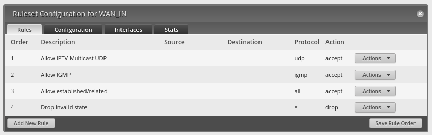

# Configurar Ubiquiti EdgeRouter para Movistar TV

Vamos a suponer que la red del HGU es la 192.168.1.0/24 y que la LAN del ER es la 192.168.10.0/24. Esta configuración debería servir para cualquier router EdgeMAX, concretamente este ejemplo se basa en un ER-X con la WAN en eth0 y el resto de puertos configurados como un switch en switch0, como se hace en la configuración básica del Wizard.

> HGU = Router de Movistar, ER = EdgeRouter.

## Si pruebas esta configuración y tienes fallos, coméntalos como issues de este repositorio

### Escenario


### 1 - Asignar a la interfaz WAN física del ER una IP fija o por DHCP dentro de la red del HGU


### 2 - Enmascarar todo el tráfico hacia la red del HGU con dicha interfaz


### 3 - Añadir un par de rutas al ER para las peticiones IGMP/Multicast

Rutas estáticas de tipo Gateway.


No estoy seguro de que sean necesarias todas, pero son las que había en la tabla del router HGU, como se puede ver a continuación:


### 4 - Configurar el Firewall del ER

Me baso en las 2 Rulesets definidas por la configuración básica del ER a través del Wizard.


#### Reglas de WAN_IN:

Es importante que se mantengan en el orden definido.




#### Reglas de WAN_LOCAL:

Las mismas que las de WAN_IN, pero sospecho que no deberían de hacer falta.

> Necesita mas pruebas.

### 5 - [Habilitar IGMP Proxy en el ER](https://help.ui.com/hc/en-us/articles/204961854-EdgeRouter-IGMP-Proxy)

Nos conectamos a la terminal del ER (por la CLI Web o por SSH).

```
configure
```

```
set protocols igmp-proxy interface eth0 role upstream
set protocols igmp-proxy interface switch0 role downstream
```

```
set protocols igmp-proxy interface eth0 threshold 1
set protocols igmp-proxy interface eth0 alt-subnet 0.0.0.0/0

set protocols igmp-proxy interface switch0 threshold 1
set protocols igmp-proxy interface switch0 alt-subnet 0.0.0.0/0
```

```
commit ; save
exit
```

#### Comandos para verificar que el tráfico multicast está fluyendo:

```
show ip multicast mfc
show ip multicast interfaces
```

### 6 - Configuración estática de red en el aparato de Movistar TV

- Pulsamos el botón superior con forma de persona en el mando de la TV de Movistar repetidas veces durante el arranque, hasta entrar en el menú de configuración de red.


- Editamos la configuración en modo estático:
    - Modo de red: estático
    - Dirección IP: 192.168.10.40
    - Máscara de Subred: 255.255.255.0
    - Pasarela (Gateway): 192.168.10.1
    - Dirección IP del OPCH: 239.0.2.29:22222
    - DNS Primario: 172.26.23.3

### Enlaces en los que me he basado

- https://help.ui.com/hc/en-us/articles/204961854-EdgeRouter-IGMP-Proxy
- https://comunidad.movistar.es/t5/Soporte-Fibra-y-ADSL/Routers-ubiquiti-con-HGU-mitrastar/m-p/3441509#M313299
- https://comunidad.movistar.es/t5/Soporte-Fibra-y-ADSL/configuracion-del-router-ax-11000-asus-por-conexion-pppoe-ONT/m-p/4217145#M427122

## Si pruebas esta configuración y tienes fallos, coméntalos como issues de este repositorio
